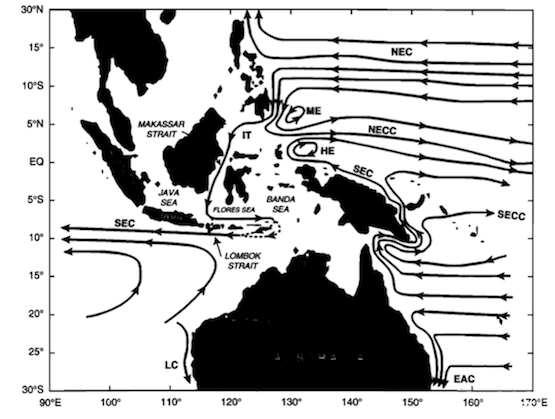
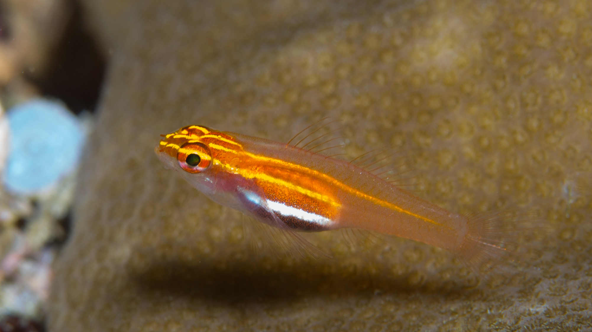
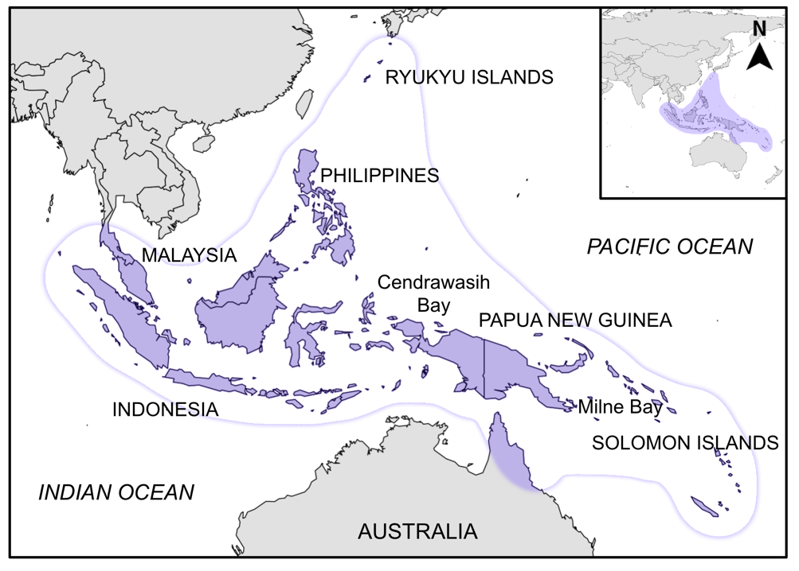
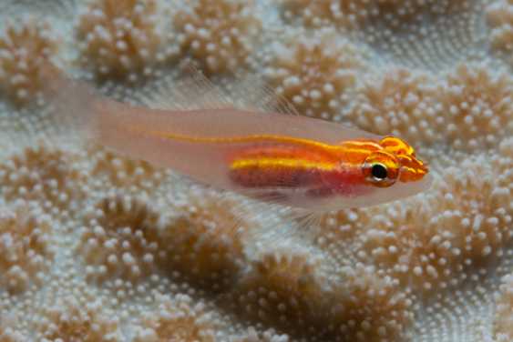
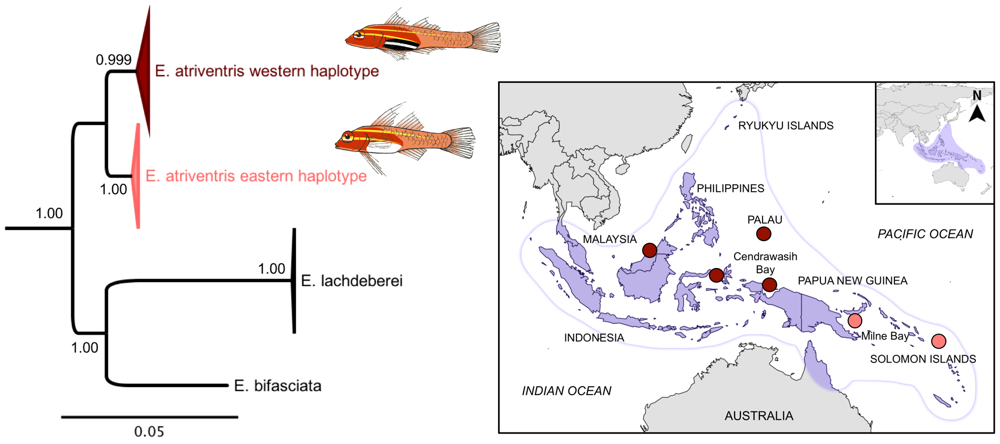

```{r setup, include=FALSE}
library(tidyverse)
#morphology data file for basic comparison analysis
morph <- read.csv("../data/cleaned_data.csv")
some_data <- read.csv("../data/morphology_numerical_data3.csv")
```

## What is a species?
- No one really knows 


## Physical barriers lead to isolation


- Isolation eventually leads to speciation

## *Eviota atriventris* 
- the Blackbelly dwarf goby 
- a cryptobenthic reef fish
```{r, out.width = "380px", echo = FALSE}
 

```

## Plot twist
- some *E. atriventris* don't have a black belly
```{r, out.width = "450px", echo = FALSE}
 
```

## Are they different?
- examine external morphology

## Pelvic fin morphology data
- contains individual ID no, sample locality, region (east or west), sex, pelvic fin characters
```{r, echo = FALSE, size = "small"}
head(morph)
```

## Cleaning up data
- I only actually need a few of these columns
```{r}
morph_better = morph %>%
  dplyr::select(locality, haplotype, fifth_fourth_ratio, pelvic_length, membrane_length)
```
```{r, echo = FALSE}
knitr::kable(head(morph_better))
```

## Comparing branch number between eastern and western populations
```{r, echo = FALSE, message = FALSE, warning = FALSE}
ggplot(data = morph) +
  geom_histogram(binwidth = 0.5, mapping = aes(x = branches, fill = haplotype), show.legend = FALSE) +
  facet_wrap(~haplotype) +
  xlab("No. branches on 4th pelvic ray") +
  theme_classic(base_family = 'Arial', base_size = 10)
```
-shows no difference between eastern and western morphs

## Analyzing all four pelvic characters at once 
- we will use a principal component analysis
```{r, echo = FALSE}
traits <- some_data %>% 
  select(fifth_fourth_ratio, pelvic_ratio, fin_membrane, branches)

pca2 <- princomp(traits, cor=T)
loadings (pca2)
```

## PCA Plot
```{r, echo= FALSE}

# plot
plot(pca2$scores[,1], pca2$scores[,2],
     cex = 1.5, 
     col = ifelse(some_data$haplotype == 1, 'tomato', 'maroon4'), 
     pch=20, 
     xlab="PC 1", ylab="PC 2", xlim=c(-2.5,5), ylim= c(-2.5,3),
     cex.axis = 0.7,
     xaxs ="i", yaxs = "i", 
     pin=c(16, 9), 
     bty="l") #take away borders

legend(x="top", 
       cex=0.8, xpd = T , horiz=T, pch=c(20), 
       col=c("tomato", "maroon4"), 
       legend = c("Eastern white-bellied morph", "Western black-bellied morph"),
       bty = "n")

#western haplotype = 1 = maroon4
#eastern haplotype = 2 = tomato
```

## Synthesis
- it is interesting that there is no morphological difference
- but there are genetic differences 
```{r, out.width = "700px", echo = FALSE}
 
```
